# Covid-19 Changed the Housing Market in Austin

There was a severe departure from the norm after the pandemic began, with both median sale price and median price per square foot rising dramatically.

Time vs. Latest Sale Price  (line graph)
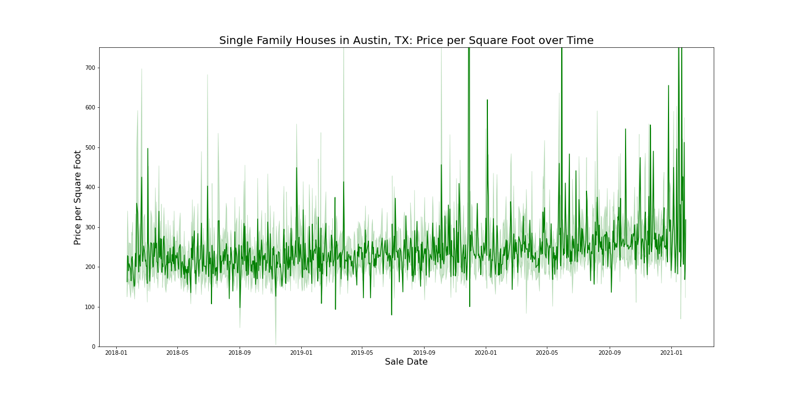

Month vs. Median Sale Price (line graph)
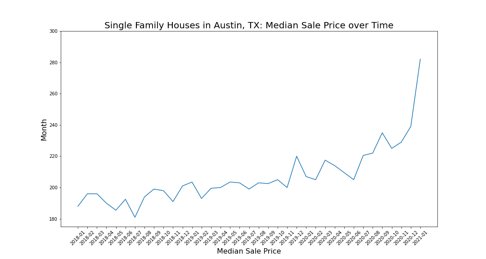

# Austin Housing Market Distribution

Many aspects of the Austin Housing Market are right-skewed, with many outliers on the high end. This matches the income distribution of Austin and the United States more generally. Latest sale price and living area square feet are given as examples.

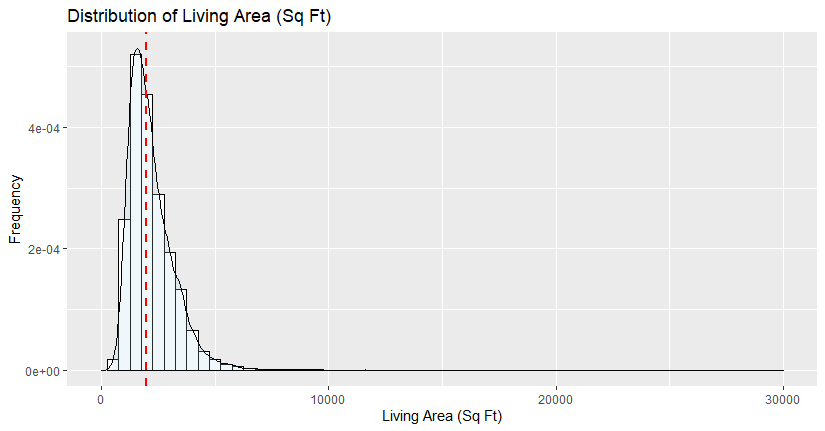

# Location is highly correlated to sale price

## Zip Code

ZIP Code vs. Sale Price (map)

**map from Tableau**

ZIP Code vs. Price per Square Foot (map)

**map from Tableau**

## Latitude and Longitude
Latitude shows an inverted U-shaped relationship with price per square foot, with proximity to downtown and the river increasing price. 
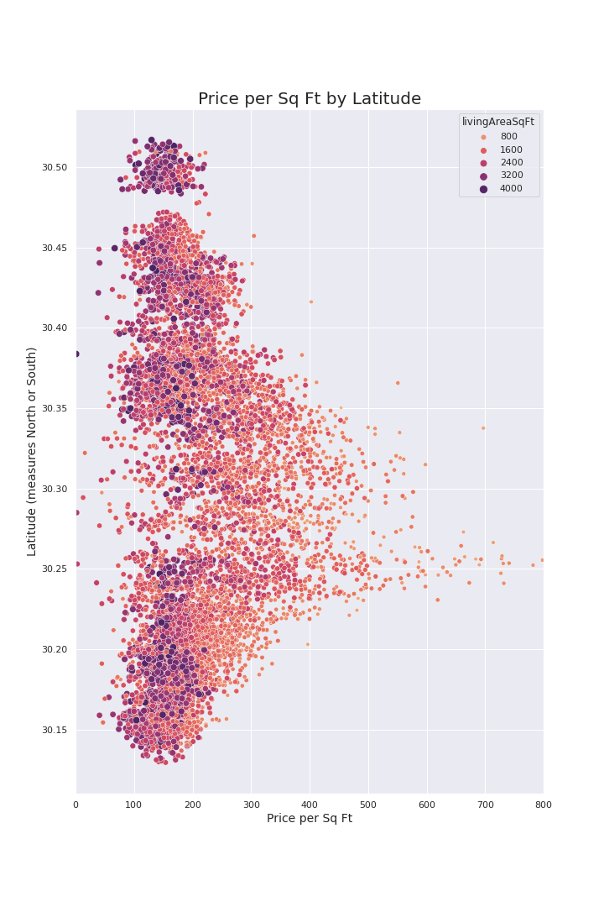

Longitude also shows an inverted U-shaped relationship with price per square foot with proximity to downtown and the river increasing price. 
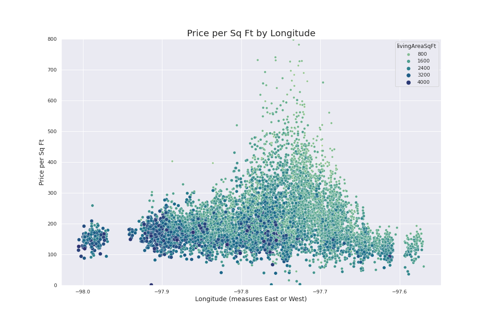

Calculated distance from the center of austin is strongly correlated with price per square foot
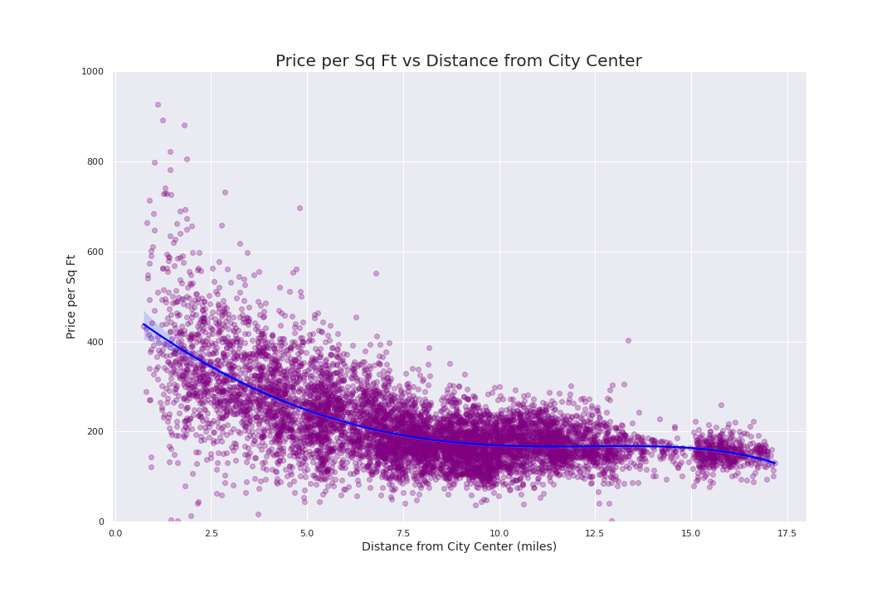

## Price per sqft has a geographic distribution on a map

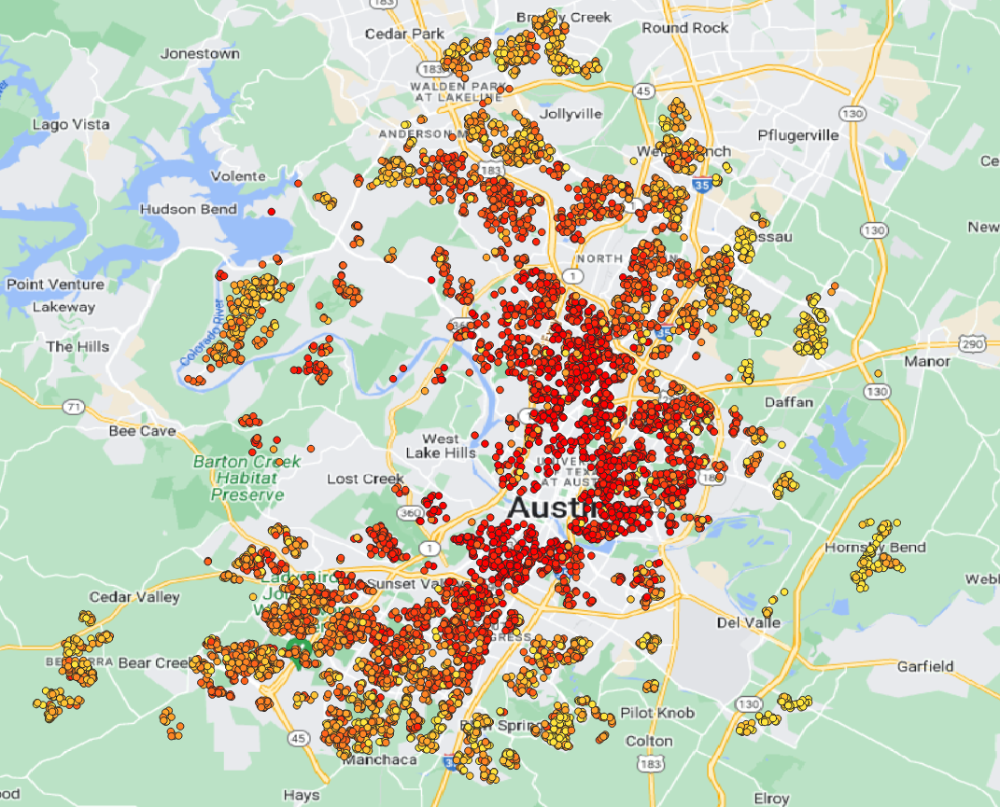

# Size is highly correlated to price

Living Area in square feet is highly correlated to price (scatterplot)
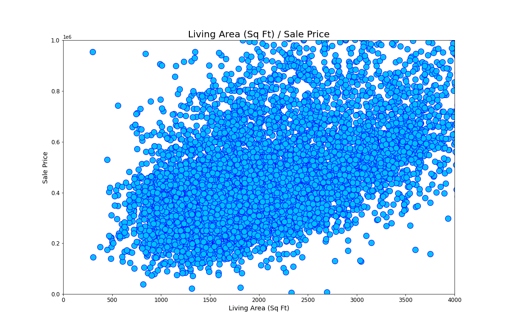

Lot area in square feet is highly correlated to price (scatterplot)
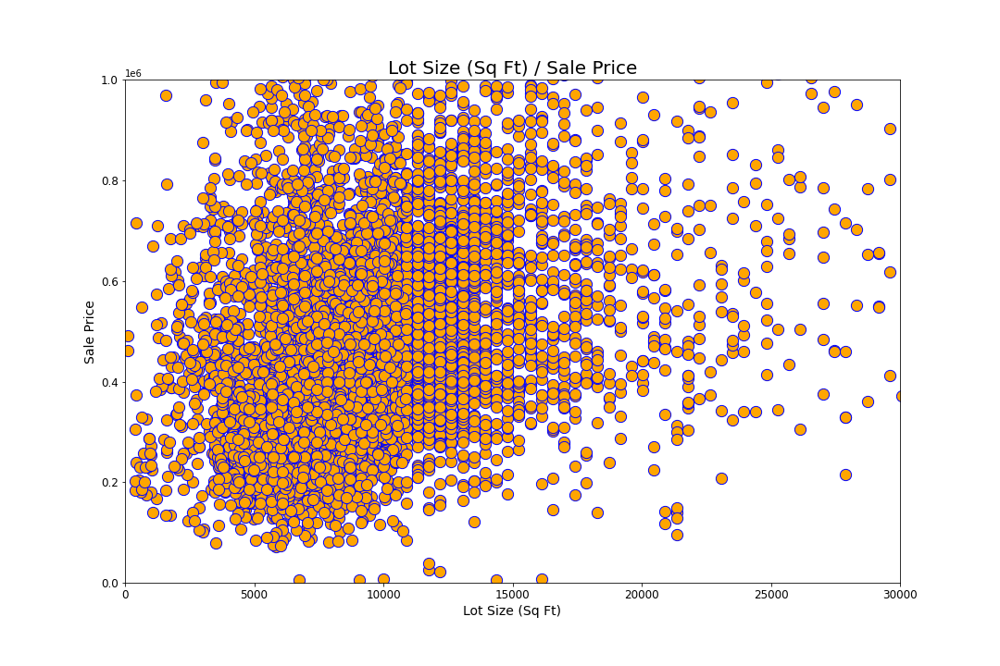

## Other Variables Correlated to Price

Similarly, there is a visually clear positive relationship between these variables and sale price: number of bathrooms, number of bedrooms.

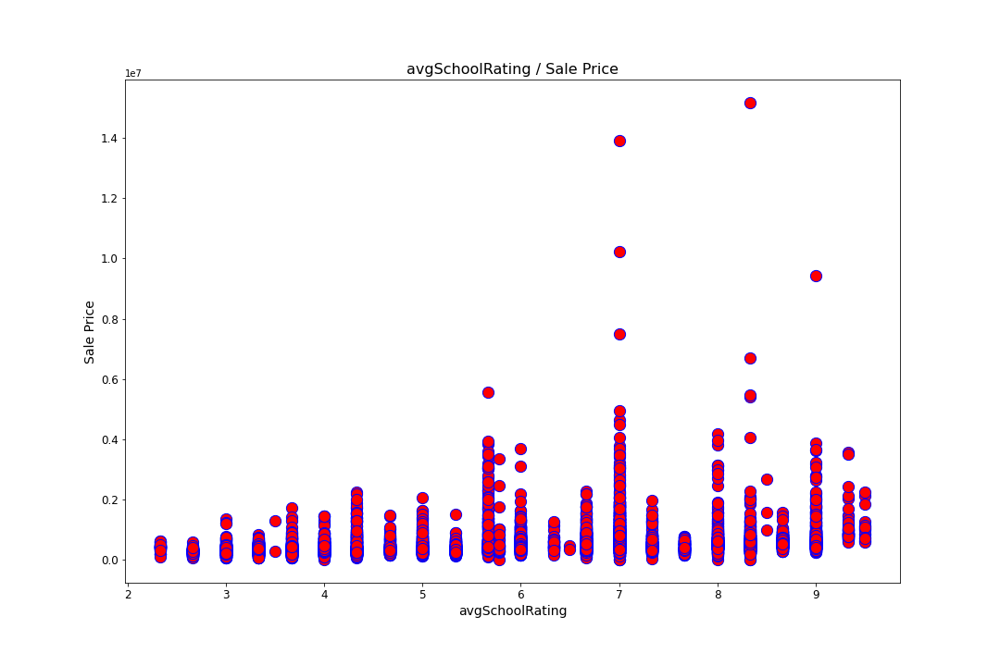
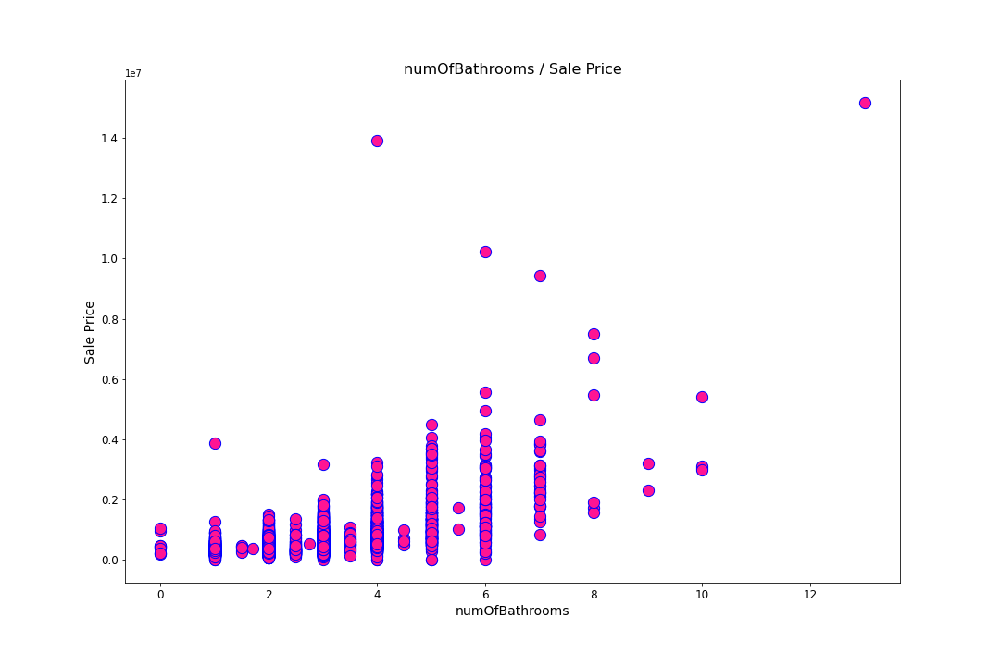

## School Ratings Correlated to Price and Location

School ratings are geographic (related to location) and also have a visually clear positive relationship to sale price.

School ratings vs. location (map)

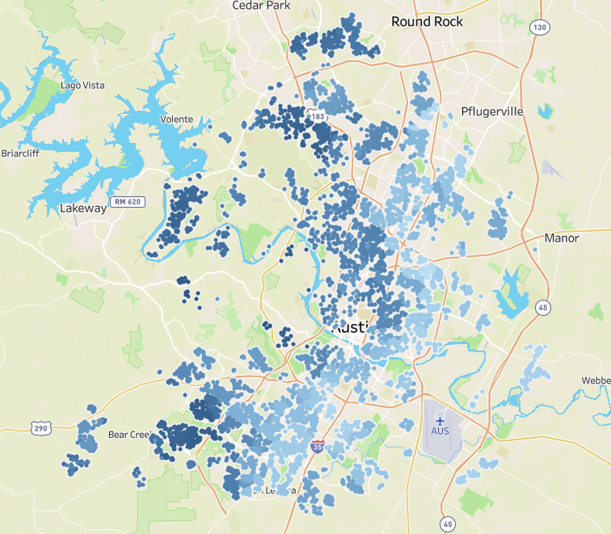

