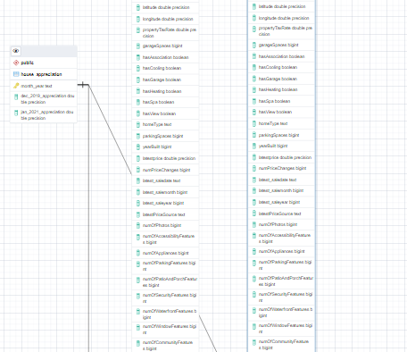
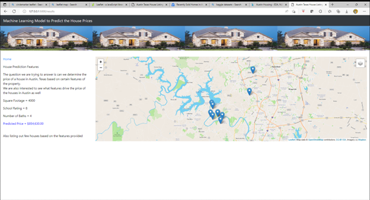

# Austin_TX_House_Listings

With mortgage rates rising and housing prices continuing to climb, a new study finds Austin has the second most overpriced housing market. It found that based on historical trends, the average price of a home in Travis County in February 2022 should have been $347,775. Instead, the study found that the actual average price is $573,123. That’s 65% higher than where historical data shows they should be.The idea of this project is to do an in-depth analysis of a dataset of Austin house sales, determine if there are any interesting relationships in the data, and apply a machine learning model to predict the price of a typical house in Austin, TX in December 2019 based on available information. 

## Resources
- Google search, https://www.kxan.com/news/local/study-austin-2nd-most-overpriced-housing-market-in-us/
- Kaggle Data set for Data https://www.kaggle.com/code/threnjen/austin-housing-eda-nlp-models-visualizations/data austinHousingData.csv

## Objective:
-   Build a Machine Learning Model to predict house prices in Austin and see what features drive the price of the houses in Austin.

### Topic Motivation
Low inventory, fiery competition and massive price gains have battered buyers since covid pandemic, but now rapidly rising mortgage rates are making it even harder to purchase an affordable home. For many buyers, higher mortgage rates mean they can no longer afford homes in specific price ranges. Even modest single-family homes cost as much as lavish pads did a few years ago, so buyers are stuck either waiting for more inventory to come online or moving to a more affordable area. And there are many more who are hoping prices will drop — but that might not happen anytime soon.  

We chose Austin, TX as our location since we are interested to see if we could apply a machine learning model to such a robust market.

### Data Source
The dataset we are using is an Austin Housing Data csv from Kaggle. We chose this dataset because it is extenseive and has the features we were looking for such as zip code, square footage, number of rooms, number of bathrooms and several others. House sales are not public record in Texas, so extensive datasets are difficult to access. This dataset was originally scraped from Zillow using a third party API. Link to the dataset is below. https://www.kaggle.com/code/threnjen/austin-housing-eda-nlp-models-visualizations/data

### Focus Questions
The question we are trying to answer is can we predict the price of a typical house in Austin, Texas.  We are also interested in what features of a house drive the price and any interesting relationships between features and price.

### Machine Learning Model
-   SciKitLearn is the python library we'll be using to create our Random Forest Regressor model. Our training and testing setup is using .7 percent of our data to train and .3 to test. 

-   Takes in data in from the provisional database 

-  Heat Map for different features to see features that correlate

### Data Cleaning and Analysis
-   Pandas and python were used to clean and analyze the data in google collab notebooks. See Cleaning Data for Machine Learning Model google collab notebook for a detailed, commented analysis. 

### Data Exploration
-   Data was explored with pandas, seaborn visualiations, tableau visualizations, and other python libraries. See Cleaning Data for Machine Learning Model google collab notebook for a detailed, commented analysis.  

### Database 
-   PostgreSQL is the database we are using. We will integrate Flask and JS to display the data on a front end. It currently contains seven tables. 

### Dashboard:
-   In addition to using a Flask template, we will also integrate D3.js for a fully functioning and interactive dashboard. It will allow a user to input features and receive a predicted price based on our machine learning model.
-   Our front end will also incorporate a Tableau story and visualizations made with other methods. 
-   We will use google slides to create a slide deck for our class presentation
    

## Communication Protocols
- Join Weekly class hours
- Join Office class hours
- Connecting via Slack  

## Branches
-   main        - main branch
-   Lucy        - Branch for Lucy
-   jayanbranch - Branch for Jayan  
-   stephenbranch - Branch for Stephen
-   raneybranch - Branch for Raney 

## Segment 1 Role
-   Raney       - Square
-   Jayan       - Triangle
-   Lucy        - Circle
-   Stephen     - X

## Segment 2 Role
-   Raney       - X
-   Jayan       - Square
-   Lucy        - Circle
-   Stephen     - Triangle
