# Austin, TX Housing Market 2018-2021: Exploratory Data Analysis, Machine Learning Model for Prediction, Visualizations 

# Background
Austin has among the most overpriced and competitive housing markets in the nation. As of July 2022, research suggests it is the second second most overpriced housing market, with a 69.20% premium relative to its long-term pricing trend. Paralleling nationwide trends in urban areas, migration to the city, low mortgage rates, and low housing supplies are fueling a booming housing market, though there are signs suggesting cooling in the latter half of 2022. Subjectively, buying a house is reportedly extremely difficult - sellers often receive multiple offers over asking price immediately after listing a property.

# Purpose
The purpose of this project was to do an in-depth exploratory analysis of Austin house sales data to 1) identify which home characteristics determine price 2) discover meaningful insights about relationships between the variables in a sale 3) apply a machine learning model to predict the price of a typical house in Austin, TX. 

# Objective:
1) identify which home characteristics determine price 
2) discover meaningful insights about relationships between the variables in a sale 
3) apply a machine learning model to predict the price of a typical house in Austin, TX. 

# Topic Motivation
As discussed in the background section, Austin, TX has an incredibly competitive housing market, fueled by low inventory and increasing demand from migration. Buyers faced additional challenges as mortgage rates began to increase in the latter half of 2021. For aspiring homeowners, the experience of trying purchase a house is harrowing, with listings receiving multiple offers over asking price almost immediately. Austin is also the home of three of our group members, two of whom are hoping to buy a home in the next five years. These exciting changes in the marekt make it an attractive target for exploratory data analysis and to practice our skills by applying a machine learning model to predict house price. 

# Data Source
We used a "AustinHousingdata" dataset sourced from Kaggle, originally scraped from Zillow by Eric Pierce using a third party API. We chose this dataset because it is extensive (over 15,000 data points), covers several years of interest (2018 - 2021), and has a broad set of house characteristics concerning location, size, rooms, school information, and more. House sales are not public record in Texas, so extensive datasets are difficult to access. In addition, other analyses of this dataset are publicly available, which provided some context for our project. You can access the full dataset here: [AustinHousingData](https://www.kaggle.com/code/threnjen/austin-housing-eda-nlp-models-visualizations/data?select=austinHousingData.csv)

# Focus Questions
1) Can we predict the price of a house in Austin under December 2019 market conditions using a machine learning model?
2) Which features drive the price of houses in Austin?
3) What other meaningful relationships between variables can be discovered in this dataset?

# Database 
-   The database management system we are using is PostgreSQL, hosted by Heroku. The database contains seven tables, and connects to our machine learning models in Google Colaboratory notebooks.  Flask and JavaScript are used to to display data from the database on our front end website. 

    

# Data Cleaning and Analysis
-   Python and pandas were used to clean and analyze the data in google colab notebooks. See the [Cleaning Data for Machine Learning Model](Jayan/Analysis/Cleaning_Data_for_Machine_Learning_Model.ipynb) google colab notebook for a detailed and commented analysis.
    - The distribution of variables was examined, including many with right-skew.
    - Poor data was identified and removed, corrected, or imputed.
    - For variables with extreme outliers, datapoints were removed. We wanted to focus on training a model that could accurately predict the price of a typical Austin house, which justified our choice of removing data points the skew the data excessively.

- Importantly, we decided to limit our data to 2018-2019 only to avoid the volatile fluctuations that occurred once the COVID-19 pandemic began. In the future, we hope to include that data as well to see how it affects our model.

- To provide the model with an up-to-date target variable, we appreciated the latest selling price to December 2019 market conditions using the median house price increase for the Austin, TX real estate market. This data was sourced from the [Texas Real Estate Research Center](https://www.recenter.tamu.edu/data/housing-activity#!/activity/Local_Market_Area_(LMA)/Austin_(Austin_BoR)). We calculated the appreciation rate by month, and used a SQL join to accomplish the final calculation of the "December 2019" price. 

# Data Exploration
-   Data was explored with pandas, seaborn visualizations, tableau visualizations, and other python libraries. See the [Cleaning Data for Machine Learning Model](Jayan/Analysis/Cleaning_Data_for_Machine_Learning_Model.ipynb) google colab notebook for a detailed and commented analysis, and our tableau dashboard for a visualization summary.

    - The Covid-19 pandemic marked a severe departure from the previous trend, with selling price and price per square foot skyrocketing. 
    - Many characteristics of sold houses in Austin, like sale price and living area, are right-skewed, with many outliers on the high-end. This parallels the right skew of the distribution of household income.
    - Location is highly correlated to sale price. Zipcode, latitude, longitude, and distance from the city center all affect price in geographically recognizable patterns. 
    - Unsurprisingly, the size of the living area and the lot of a house are both strongly positively correlated to price.
    - School ratings have a recognizable geographic patterna and is strongly positively correlated to price.    

# Machine Learning Model

## Initial Exploration

- We used the Scikit-learn python library to create our models. We tried a variety of linear models before moving on to ensemble methods, including Random Forest Regressor, AdaBoost, and XGBoost. 

- We split our data into 70% training data and 30% testing data.

- Our models take in static data from our Heroku SQL database.

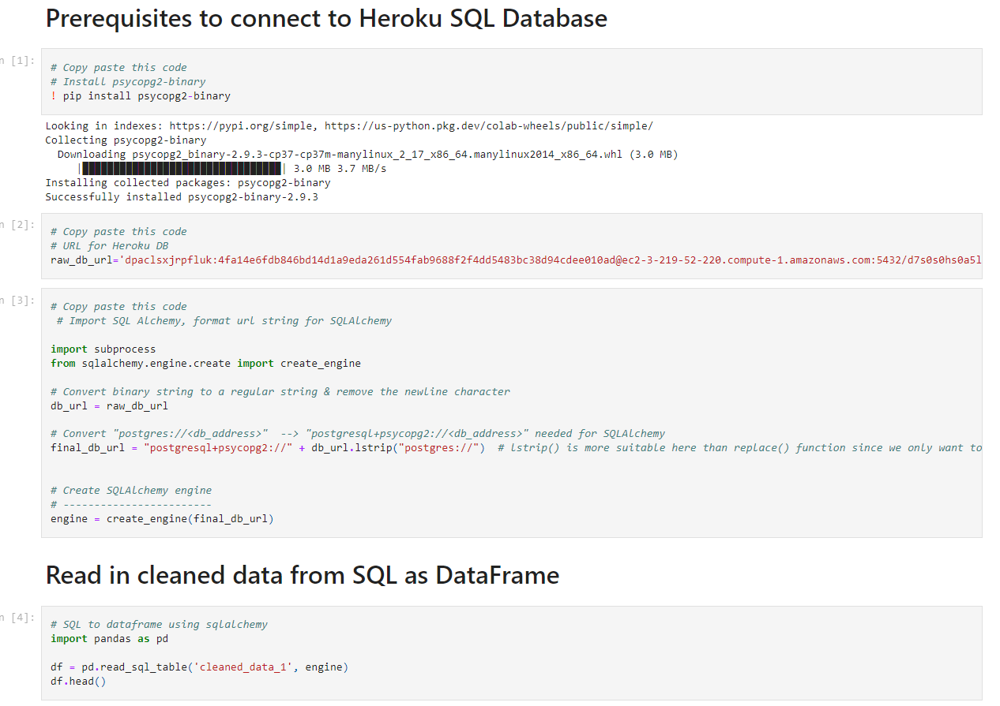

- Our original trials settled on the Random Forest Regressor as the likely best option. A first trial with no feature selection and zip code manually hot encoded resulted in an impressive coefficient of determination of 0.743, a significant improvement over the linear models.

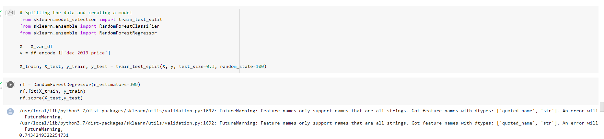

## Feature Selection

- We explored correlations using a heat map and scatterplots to find variables that were strongly correlated with house price.

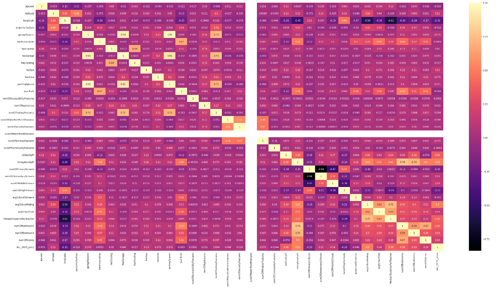
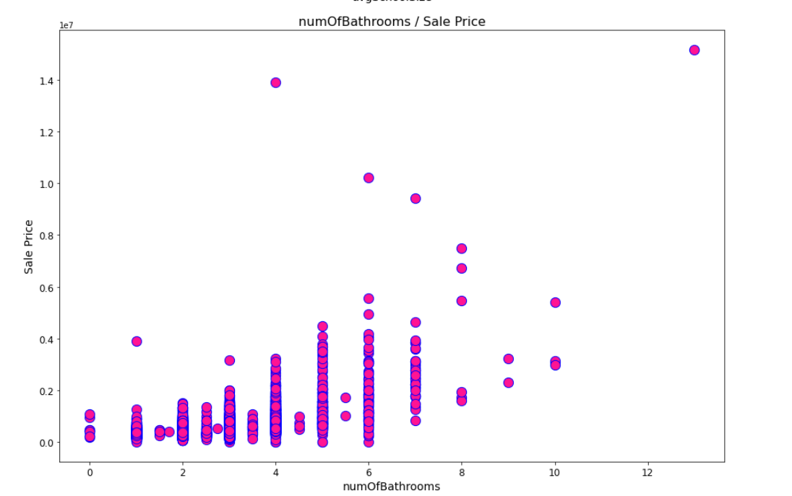

- Random Forest models conveniently intrinsically rank features according to their importance to the model. We used the SelectFromModel meta-estimator to visualize and select only those features that were above the mean importance level - 10 in total: 'zipcode','latitude', 'longitude', 'yearBuilt', 'numOfAppliances', 'lotSizeSqFt', 'livingAreaSqFt', 'avgSchoolDistance', 'avgSchoolRating', 'avgSchoolSize'.

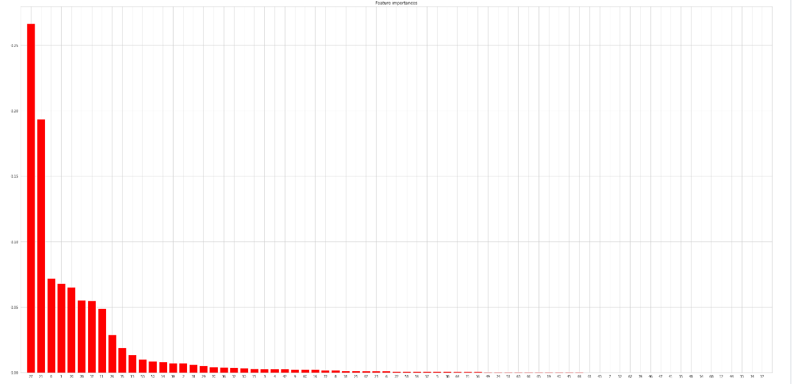

- Ultimately, dropping these features did not improve our model - the coefficient of variation stayed about the same (0.741). Random forest models are good at finding the signal in the noise, and generally reducing the data available, even if it has low importance, does not improve its predictions. Still, we were able to reduce the number of features fed into the model by over half without meaningfully affecting its power. 

## Front End Model

- We intended to make a model that could provide a house price based on user input on a front end. For this model, we decided to reduce the number of features to only those that would be practical for a user to know and enter: zip code, year built, lot size in square feet, living area in square feet, and average school rating. This first attempt achieved a coefficient of determination of 0.703, significantly lower than the model using 10 features.

### Hyperparameter Tuning

- We used RandomizedSearchCV to search for best hyperparameters for our first front end model from a pre-defined grid. The tuned model with manually hot encoded zip code achieved a coefficient of determination of 0.733.

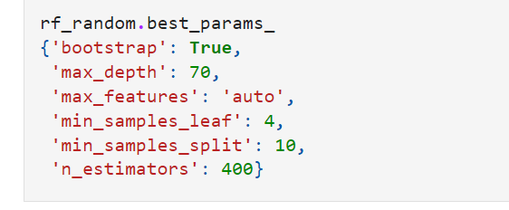

### Pipeline for Front End

- On testing the model for the front end, we realized that it would be difficult to code the user input of the hot encoded variable. We made an updated model using a column transformer pipeline which allowed for the zipcode to be input as a string and transformed within the model before being fed into the random forest regressor. We repeated hyperparameter tuning on this model as well, achieving a coefficient of determination of 0.718. Interestingly, this was slightly lower than the score for the same model with manually hot encoded zip code. 

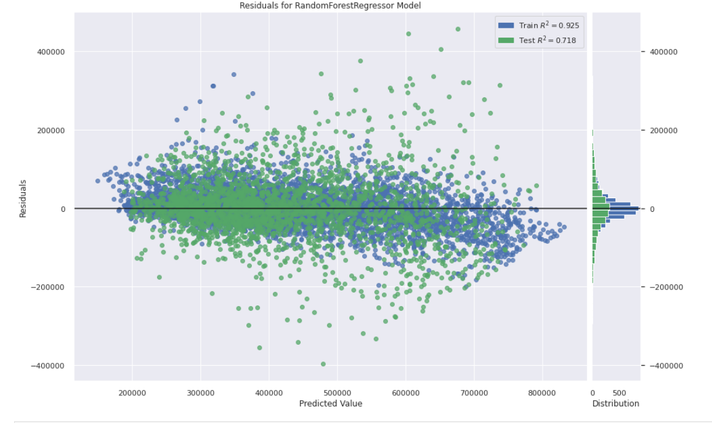

## Explanation of Front End Model

We chose the Random Forest Regressor based on empirical experimentation with the accuracy of different models. Random forest is a supervised learning algorithm that uses an ensemble learning method for classification or regression. It uses multiple decision trees running in parallel, and averages the predictions of each to make a final prediction. With bootstrapping on, each decision tree trains on a subset of the data. In addition, random forest uses a random subset of features to make decisions at each split. 

We used the built-in feature selection function to determine feature importances and reduce the amount of input for the ideal model, but this did not result in improved explained variation. We further reduced the number of features to only 5 for the purposes of creating a model for interactive prediction on our front end ('zipcode' - hot encoded, 'yearBuilt', 'lotSizeSqFt', 'livingAreaSqFt', 'avgSchoolRating'), and incorporated a column transformer pipeline to allow for string input. 

We continued to improve the model by performing a grid search for hyperparameters, reaching a coefficient of determination of 0.71 for our front end model.

### Benefits of the Random Forest Regressor Model
- Robust to outliers and non-linear data
- Scaling and normalization is not necessary.
- Handles large datasets well
- Provides variable importance intrinsically, allowing you to draw conclusions about what is driving the prediction. 
- 
### Limitations of the Random Forest Regressor Model
- Are difficult to interpret compared to linear regression, which can output an equation. Decision trees can be viewed, but they are large and high in number. As an ensemble method, the decisions of individual trees are averaged, making viewing any single tree less useful.
- When the data set is large, the model takes up a lot of memory.
- It has a tendency to overfit. 
- It cannot extrapolate outside the dataset.

## Accuracy

- The dataset lacks important information that is often used in housing prediction models, which may explain why it is only moderately accurate. Examples of other desirable features include: home quality, last renovation, neighborhood quality.

## Model Comparison

After finalizing a model for the front end, we continued to compare options for models to try to optimize the predictions. Some variations included:
- incorporating a hot encoding pipeline or manually hot encoding
- scaling using MinMaxScaler
- using other ensemble models like AdaBoost and XGBoost
- using all 34 features, 10 selected features, or the 5 front end features

XGboost proved to be slightly better than our best Random Forest Regressor model, with an R^2 of 0.748 vs 0.742. 

**will discuss further for deliverable 4**

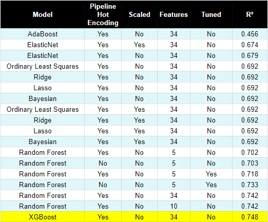
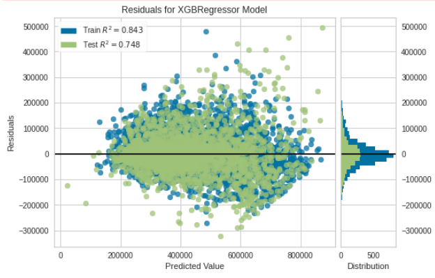

# Dashboard:
-   We combined Flask with D3.js to create a web application as a front end for our project. 
-   The front end allows a user to input variables and receive a prediction based on our machine learning model.
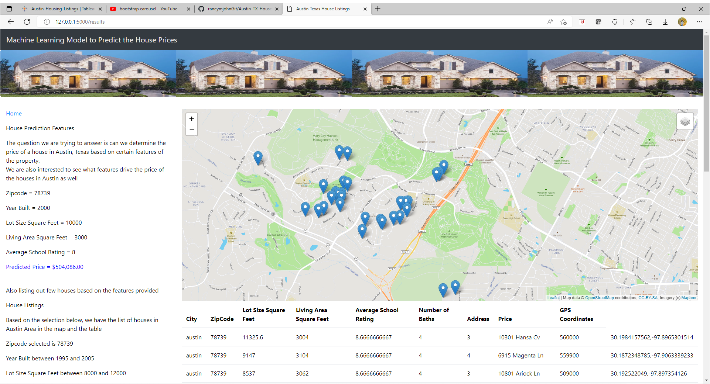
-   Our front end also incorporates a tableau story with the most important visualizations from our exploratory data analysis.
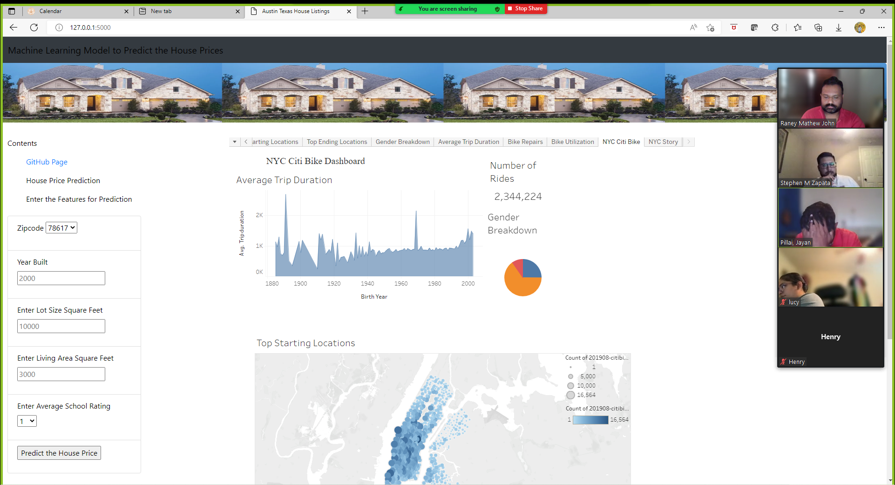

# Resources
- Kaggle Data Set: https://www.kaggle.com/datasets/ericpierce/austinhousingprices
- Austin Housing - EDA, NLP, Models, Visualizations, Jen Wadkins: https://www.kaggle.com/code/threnjen/austin-housing-eda-nlp-models-visualizations/data?select=austinHousingData.csv
- Texas A&M University Texas Real Estate Research Center, Housing Activity for Austin (Austin BoR) : https://www.recenter.tamu.edu/data/housing-activity#!/activity/Local_Market_Area_(LMA)/Austin_(Austin_BoR)
- Top 100 Housing Markets: https://business.fau.edu/executive-education/housing-market-ranking/housing-top-100/index.php
- House Price Prediction With Machine Learning in Python: https://medium.com/codex/house-price-prediction-with-machine-learning-in-python-cf9df744f7ff
- House Prices Prediction Using Random Forest: https://medium.com/hackerdawn/house-prices-prediction-using-random-forest-aa8722347276
- How to Use the ColumnTransformer for Data Preparation :https://machinelearningmastery.com/columntransformer-for-numerical-and-categorical-data/

# Google Slides Presentation 

[Google Slides Presentation](https://docs.google.com/presentation/d/1qW7ySGBoWv22oxZI2QIVgwt6B0VDeACSnAcm5nQMxZI/edit?usp=sharing)

# What would we do differently?

- Try to scrape Zillow ourselves to get up to date data
- Use the data points through 2021 to see if the model can predict prices even during the pandemic
- Explore how the pandemic affected prices differently based on location
- Use packages like Yellowbrick to quickly and efficiently visualize model performance and select features
- Try using neural networks

-------------------------------------------------------------------------
# Branches
-   main           - Main Branch
-   Lucy           - Branch for Lucy
-   jayanbranch    - Branch for Jayan  
-   stephenbranch  - Branch for Stephen
-   raneybranch    - Branch for Raney 
-   Visualizations - Branch for Visuals

# Segment 3 Role
-   Raney - X
-   Jayan - Square
-   Lucy - Circle
-   Stephen - Triangle 

# Segment 4 Role
-   Raney
-   Jayan
-   Lucy
-   Stephen
